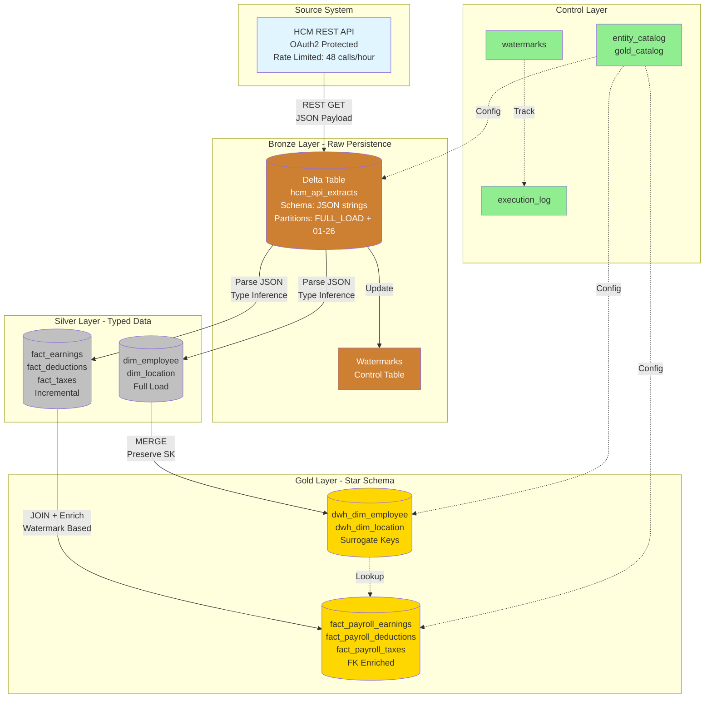
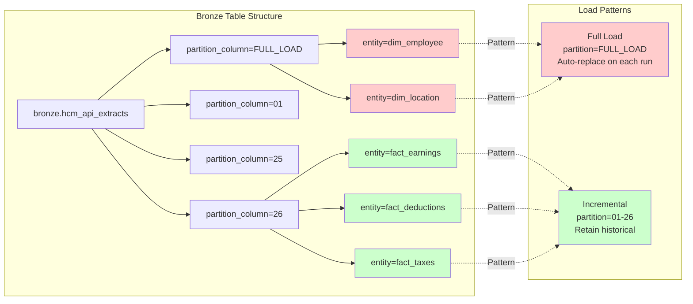
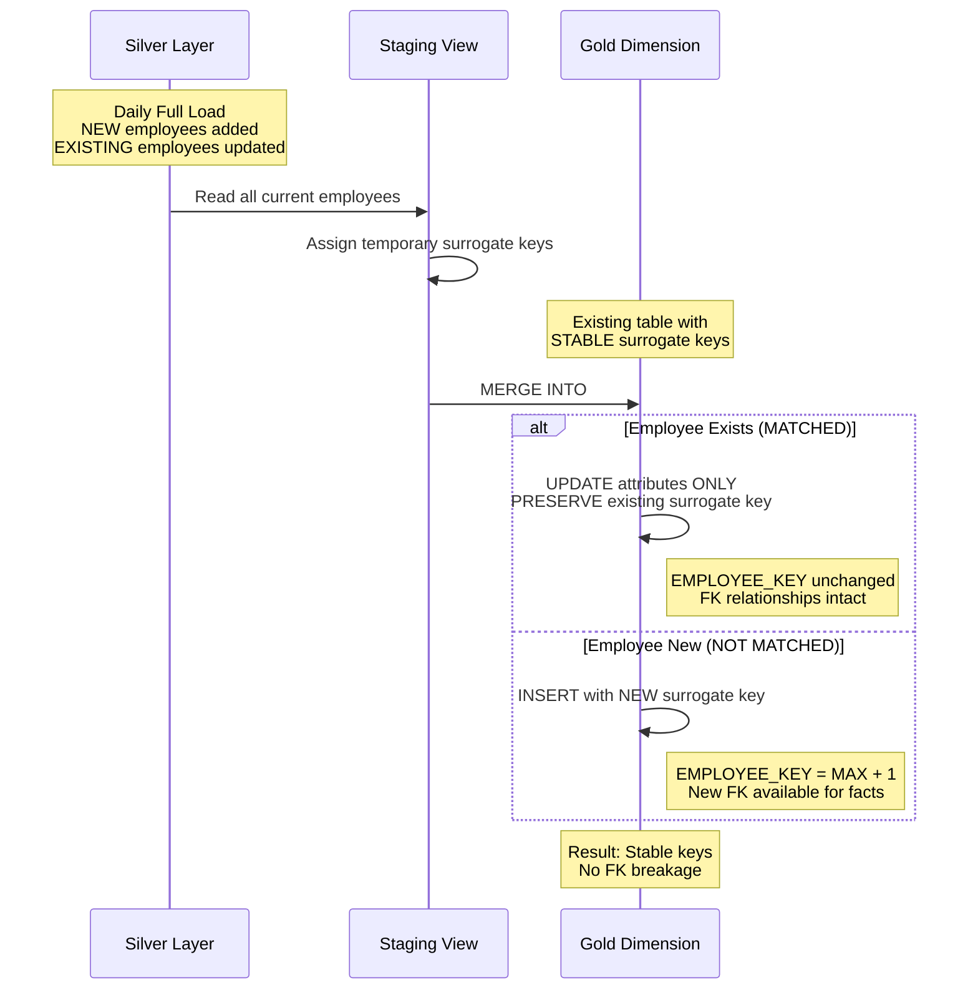
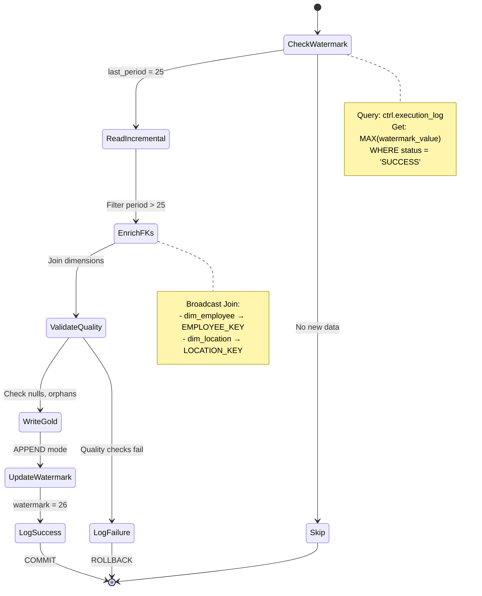
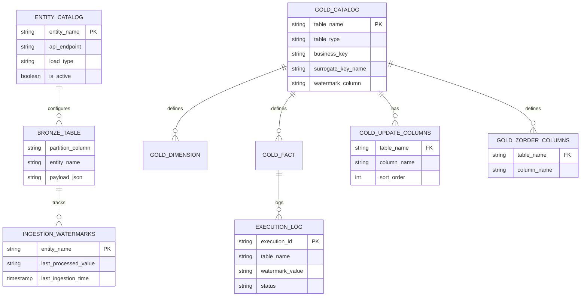
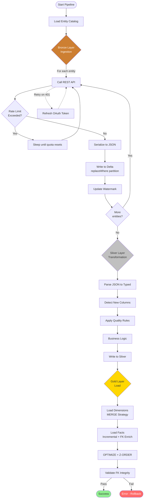
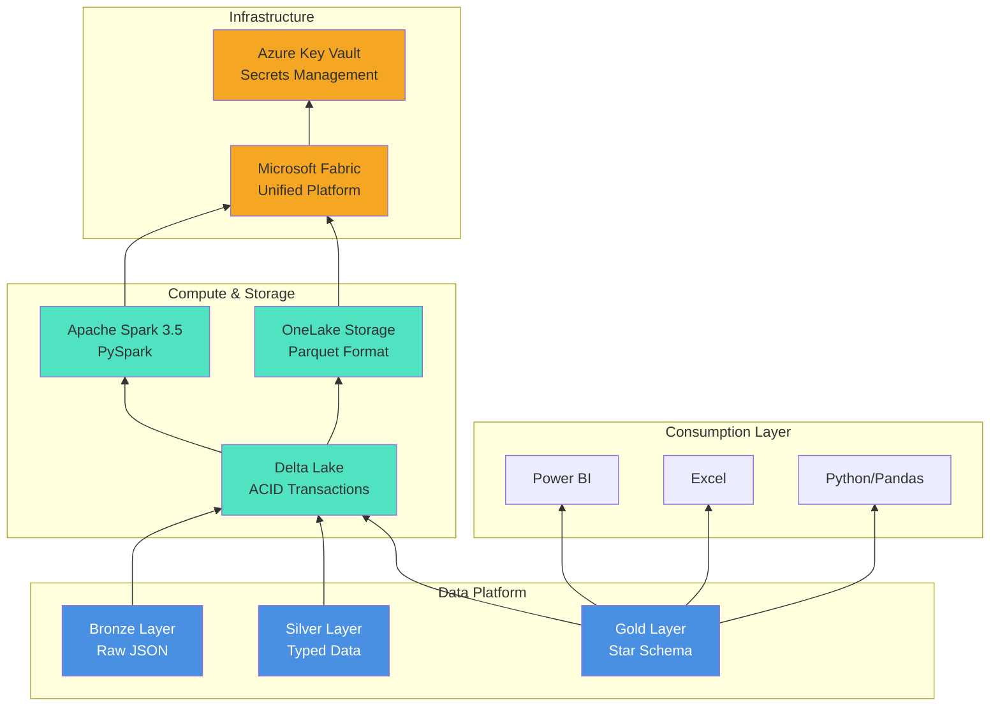
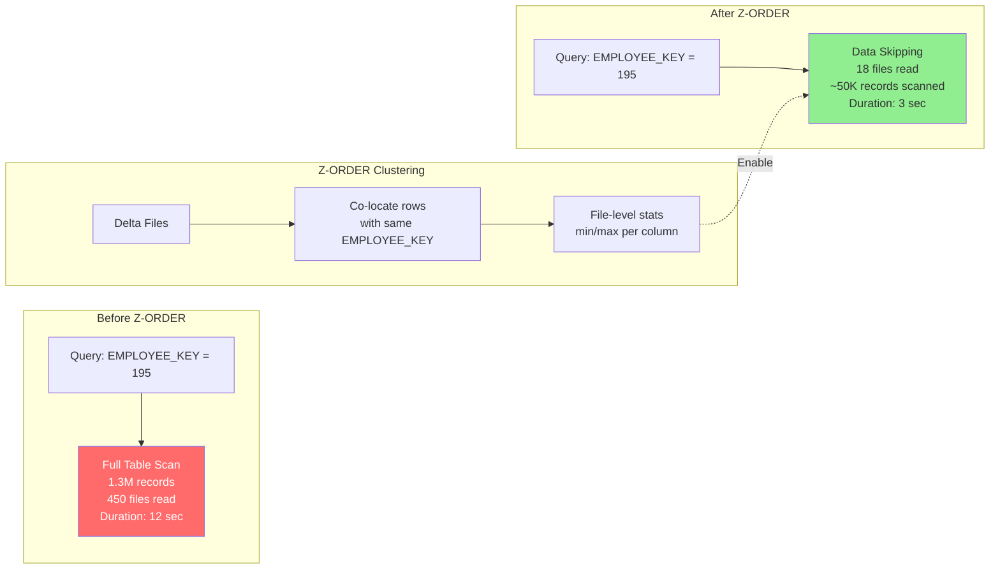

# Architecture Diagrams

## End-to-End Data Flow



---

## Dual Partition Strategy (Bronze Layer)



**Benefits**:
- ✅ Single unified table (no *_full vs *_incremental split)
- ✅ Self-documenting (partition value = load type)
- ✅ Automatic cleanup (FULL_LOAD overwrites)
- ✅ Historical retention (periods 01-26 preserved)

---

## Surrogate Key Preservation (Gold Dimensions)



**Critical Pattern**: Without MERGE, full overwrite would regenerate ALL keys → facts lose referential integrity

---

## Incremental Fact Loading with Watermarks



**Idempotency**: Running period 26 multiple times → same result (watermark doesn't advance past 26)

---

## Control Table Dependencies



**Pattern**: All pipeline behavior driven by control tables, not hardcoded configurations

---

## Orchestration Flow



---

## Storage Layout

```
📦 OneLake (Delta Lake Format)
│
├── 🥉 bronze/
│   └── sens/
│       └── hcm_api_extracts/
│           ├── partition_column=FULL_LOAD/
│           │   ├── entity_name=dim_employee/
│           │   │   └── part-00000-*.snappy.parquet  (latest snapshot)
│           │   └── entity_name=dim_location/
│           │       └── part-00000-*.snappy.parquet
│           ├── partition_column=25/
│           │   ├── entity_name=fact_earnings/
│           │   ├── entity_name=fact_deductions/
│           │   └── entity_name=fact_taxes/
│           └── partition_column=26/  (current period)
│               └── ...
│
├── 🥈 silver/
│   └── sens/
│       ├── dim_employee/  (no partitions)
│       ├── dim_location/  (no partitions)
│       ├── fact_earnings/
│       │   ├── pay_period_id=25/
│       │   └── pay_period_id=26/
│       ├── fact_deductions/
│       └── fact_taxes/
│
└── 🥇 gold/
    └── dbo/
        ├── dwh_dim_employee/  (optimized, Z-ORDERed)
        ├── dwh_dim_location/
        ├── fact_payroll_earnings/  (Z-ORDER: EMPLOYEE_KEY, PAY_PERIOD_ID)
        ├── fact_payroll_deductions/
        └── fact_payroll_taxes/
```

---

## Technology Stack



---

## Query Optimization - Z-ORDER Impact



**Command**: `OPTIMIZE gold.fact_payroll_earnings ZORDER BY (EMPLOYEE_KEY, PAY_PERIOD_ID)`

**Result**: 4x query performance improvement on filtered queries

---

These diagrams illustrate:
1. **Data Flow**: End-to-end architecture
2. **Partitioning**: Dual partition strategy benefits
3. **MERGE Pattern**: Surrogate key preservation
4. **Watermarks**: Incremental processing logic
5. **Control Tables**: Metadata-driven configuration
6. **Orchestration**: Complete pipeline workflow
7. **Storage**: Physical layout on OneLake
8. **Technology**: Complete stack visualization
9. **Optimization**: Z-ORDER performance impact

For interactive diagrams, copy markdown code blocks to [Mermaid Live Editor](https://mermaid.live/).
